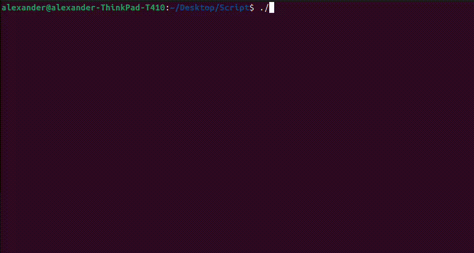

## Description

CLI tool that lets you create an Anki vocabulary deck with mp3 files. 

First, you enter a word that you want to translate. Possible translations are displayed, and you can choose if you want to save a card with one of them to your deck. Then, you are prompted for the next word you want to translate. 

## Prerequisites

This script depends on [Translate Shell](https://github.com/soimort/translate-shell) and [Google Text-to-Speech](https://github.com/pndurette/gTTS) command-line interface. It's assumed you already have installed [Anki](https://apps.ankiweb.net/).

### Install gTTS

#### via pip (if your using a virtuall environment)

```bash
pip install gTTS
```

#### via your systems package manager

##### Debian / Ubuntu

```bash
sudo apt install python3-gtts
```

##### Arch Linux

```bash
sudo pacman -S python-gtts
```

### Install Translate Shell 

#### via your systems package manager

##### Debian / Ubuntu

```bash
sudo apt install translate-shell
```

##### Arch Linux

```bash
sudo pacman -S translate-shell
```

## Usage 

```bash
./trans_to_anki_script.sh <source language code> <target language code> <savepath>
```

Demo


Importing the deck in Anki

